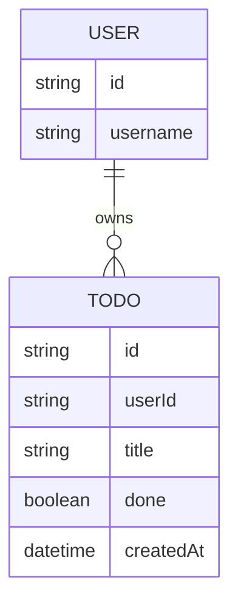

# Domain model

A minimal model: each signed-in `User` owns a private list of `Todo` items.

`User` is the identity asserted by Thunder at sign-in — the API never stores a
password. `Todo.userId` ties every row to its owner and is always resolved from
the caller's own signed assertion, never from client input.