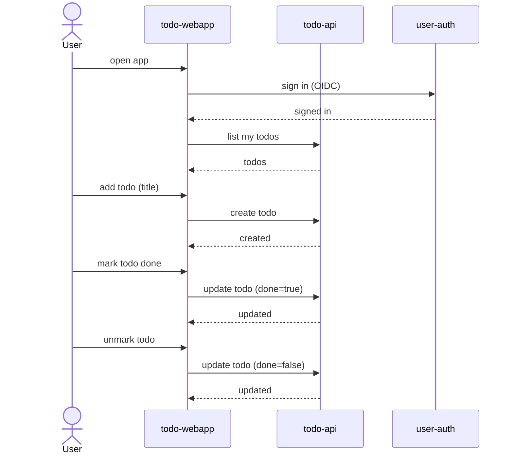

# Manage todos

A signed-in User adds a todo and later marks it done, then undoes that mark.

```mermaid
sequenceDiagram
    actor User
    participant todowebapp as todo-webapp
    participant todoapi as todo-api
    participant userauth as user-auth

    User->>todowebapp: open app
    todowebapp->>userauth: sign in (OIDC)
    userauth-->>todowebapp: signed in
    todowebapp->>todoapi: list my todos
    todoapi-->>todowebapp: todos
    User->>todowebapp: add todo (title)
    todowebapp->>todoapi: create todo
    todoapi-->>todowebapp: created
    User->>todowebapp: mark todo done
    todowebapp->>todoapi: update todo (done=true)
    todoapi-->>todowebapp: updated
    User->>todowebapp: unmark todo
    todowebapp->>todoapi: update todo (done=false)
    todoapi-->>todowebapp: updated
```

